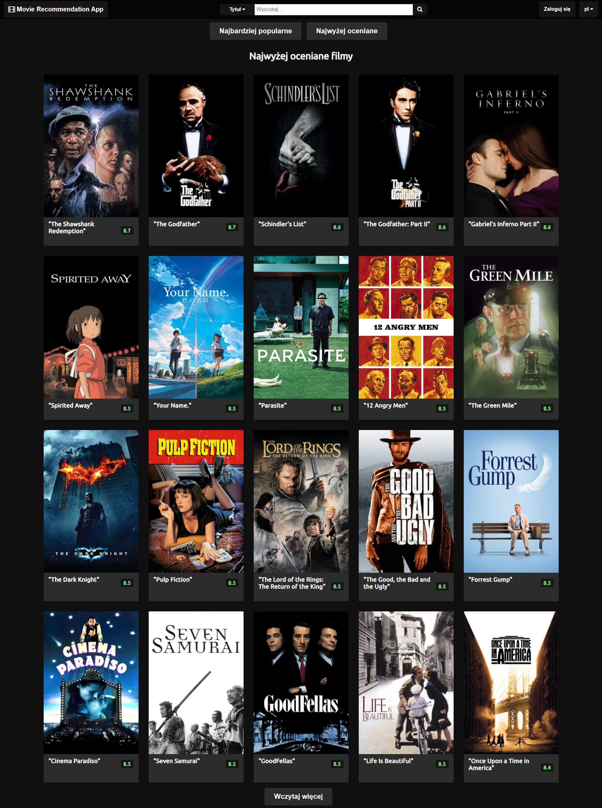
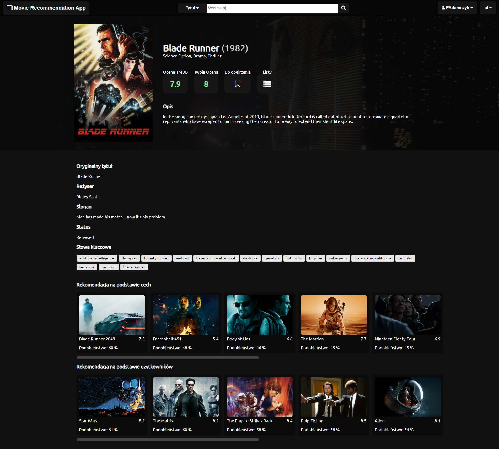
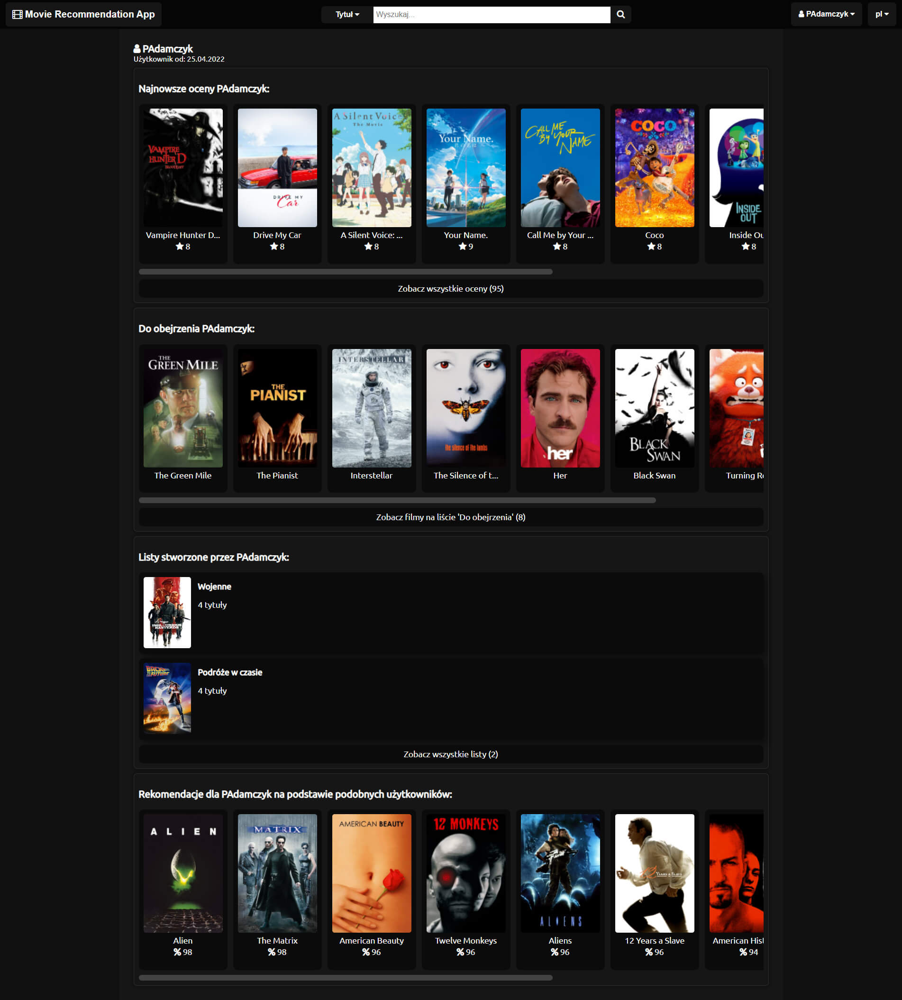

# Movie_Site_New

A Django-based movie recommendation system that includes 4 types of recommender systems. 2 types of content-based, and 2 types of collaborative. Recommender systems are based on k-nearest neighbors algorithms using cosine and euclidean distances. The database was filled using TMDB API (movies) and MovieLens dataset (ratings).
Movie Recommendation App is my Engineer's Thesis project.

You can download the necessary "media" folder and database from there:
https://drive.google.com/drive/folders/13mg9sVEBo6GD3s_G_kUHbaKdIMOsETto?usp=sharing

Main Page:

Movie Page:

User Page:

